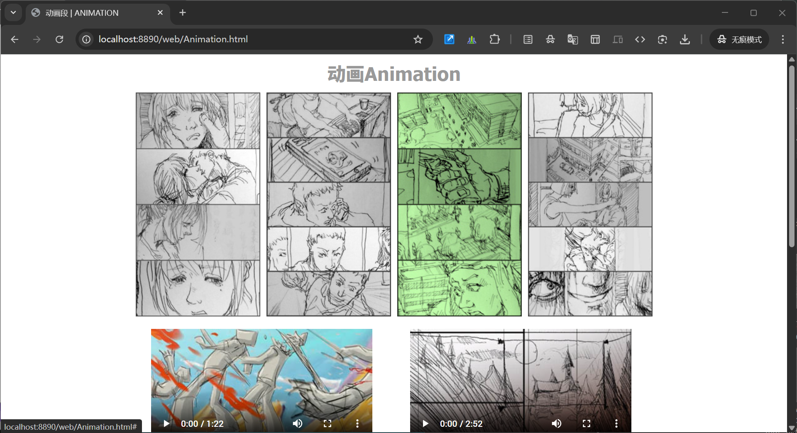
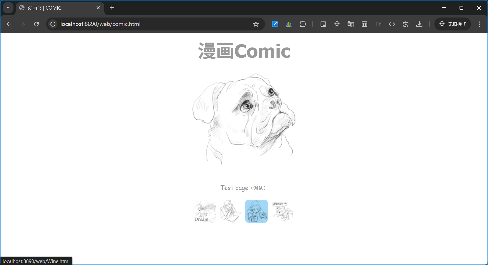
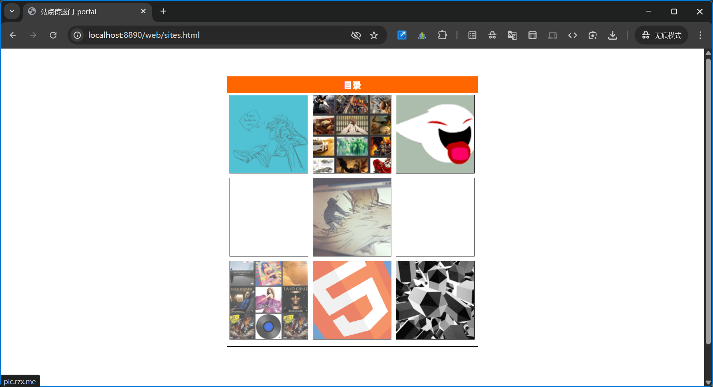
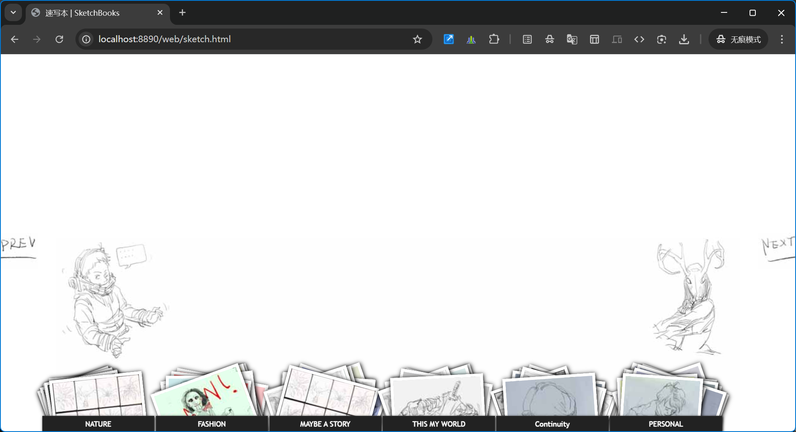
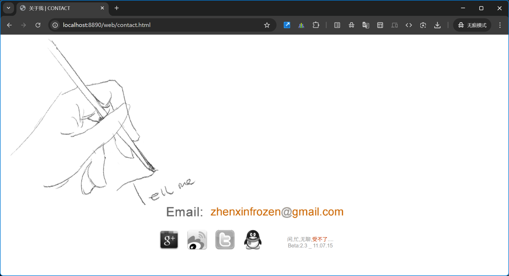

# rzx.me

**项目版本：** v3.0.0
**历史时期：** 2009–2012（大学期间）

## 简介
本仓库为作者个人作品集站点的静态源码。全部页面为手写 HTML/CSS/JavaScript，风格保留大量手绘元素与创意交互（历史上部分页面使用 Flash，现已用 JS/静态替代以提升兼容性）。

原始域名：www.ruizhenxin.com

## 目录概览
- `index.html` — 主页
- `web/` — 各类作品页面（Animation、Comic、SketchBooks、Pictures、Sites 等）
- `img/` — 图片资源（含 `img/screenshots/`）
- `css/` — 样式表
- `Scripts/` — 本地脚本

## 特色
- 纯静态、易部署（GitHub Pages / Netlify / Vercel 等）
- 手绘图标替代常见 UI 状态图，保留手作质感
- 保留历史兼容逻辑，便于回溯与学习前端演进

## 快速运行（本地预览）
在仓库根目录运行任一本地服务器：

```bash
# Python 3
python -m http.server 8000

# 或使用 PHP 内置服务器
php -S localhost:8000
```

然后访问： `http://localhost:8000/`

## 界面截图
以下为 v3.0.0 下的页面截图，文件位于 `img/screenshots/`。可用于 UI 归档与回溯。


### 界面预览（全部展开）

以下为 v3.0.0 的页面截图，按双列展示。图片下方为文件名，点击图片可查看原图。

<div style="display:flex;flex-wrap:wrap;gap:18px;">

	<div style="flex:1 1 48%;text-align:center;">
		<a href="img/screenshots/v3.0.0/Screenshot-v3.0.0-home.png"></a>
		<div style="font-size:0.9em;color:#666;margin-top:6px">Screenshot-v3.0.0-home.png</div>
	</div>

	<div style="flex:1 1 48%;text-align:center;">
		<a href="img/screenshots/v3.0.0/Screenshot-v3.0.0-animation.png"></a>
		<div style="font-size:0.9em;color:#666;margin-top:6px">Screenshot-v3.0.0-animation.png</div>
	</div>

	<div style="flex:1 1 48%;text-align:center;">
		<a href="img/screenshots/v3.0.0/Screenshot-v3.0.0-latest.png"></a>
		<div style="font-size:0.9em;color:#666;margin-top:6px">Screenshot-v3.0.0-latest.png</div>
	</div>

	<div style="flex:1 1 48%;text-align:center;">
		<a href="img/screenshots/v3.0.0/Screenshot-v3.0.0-comic.png"></a>
		<div style="font-size:0.9em;color:#666;margin-top:6px">Screenshot-v3.0.0-comic.png</div>
	</div>

	<div style="flex:1 1 48%;text-align:center;">
		<a href="img/screenshots/v3.0.0/Screenshot-v3.0.0-sites.png"></a>
		<div style="font-size:0.9em;color:#666;margin-top:6px">Screenshot-v3.0.0-sites.png</div>
	</div>

	<div style="flex:1 1 48%;text-align:center;">
		<a href="img/screenshots/v3.0.0/Screenshot-v3.0.0-sketch.png"></a>
		<div style="font-size:0.9em;color:#666;margin-top:6px">Screenshot-v3.0.0-sketch.png</div>
	</div>

	<div style="flex:1 1 48%;text-align:center;">
		<a href="img/screenshots/v3.0.0/Screenshot-v3.0.0-pictures.png"></a>
		<div style="font-size:0.9em;color:#666;margin-top:6px">Screenshot-v3.0.0-pictures.png</div>
	</div>

	<div style="flex:1 1 48%;text-align:center;">
		<a href="img/screenshots/v3.0.0/Screenshot-v3.0.0-contact.png"></a>
		<div style="font-size:0.9em;color:#666;margin-top:6px">Screenshot-v3.0.0-contact.png</div>
	</div>

	<div style="flex:1 1 48%;text-align:center;">
		<a href="img/screenshots/v3.0.0/Screenshot-v3.0.0-404.png"></a>
		<div style="font-size:0.9em;color:#666;margin-top:6px">Screenshot-v3.0.0-404.png</div>
	</div>

</div>

---

## 建议的后续优化（可选采纳）

- 增加 **部署** 节，写明如何把仓库部署到 GitHub Pages / Netlify，并示例 DNS/CNAME 处理
- 为每个页面在 README 中加入一行简短说明（目的、展示内容、关键技术点）
- 若希望长期保存版本截图，保留 `img/screenshots/` 并按版本创建子目录（如 `img/screenshots/v3.0.0/`）

## 联系方式

- 作者：芮真心（Ray）
- 邮箱：zhenxinfrozen@gmail.com

---

*注：仅整理 README 格式与截图展示，未更改作者信息或内容。*
